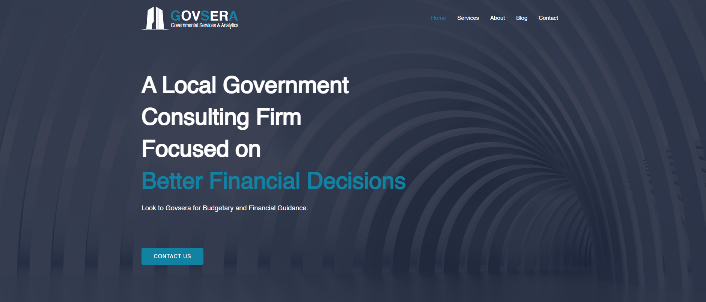
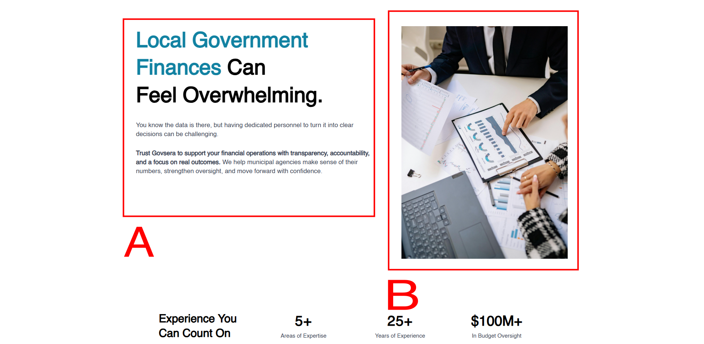
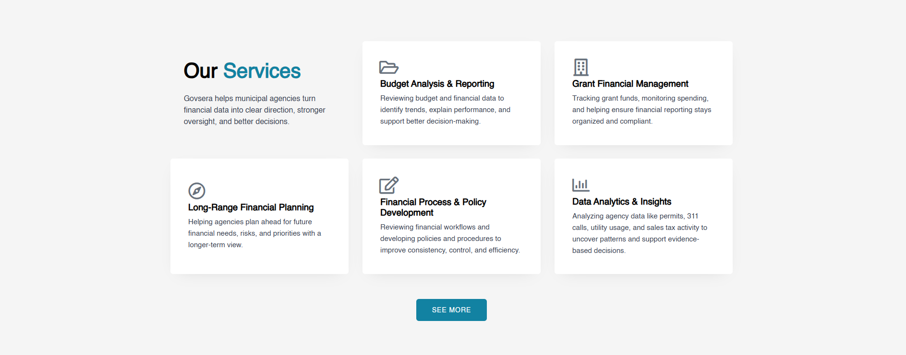

<h1>Layout System Implementation (Page 3)</h1>

  

    The homepage layout was reviewed to understand how content sections,
    spacing, alignment, and visual grouping were used to create a clear page
    structure.
  

  > For simplicity, this section focuses on the homepage and selected areas of analysis.
  

  <h2>Areas Reviewed</h2>

  <ul>
    <li>Page section flow</li>
    <li>Hero layout</li>
    <li>Two-column content sections</li>
    <li>Card-based service grid</li>
    <li>Visual grouping and section separation</li>
    <li>Footer layout</li>
  </ul>

  <h2>Page Section Flow</h2>

 [View full homepage layout](homepage.png)

  
The homepage follows a clear top-to-bottom structure:

  <ol>
    <li>Hero section</li>
    <li>Problem / value section</li>
    <li>Services section</li>
    <li>Why section</li>
    <li>Audience section</li>
    <li>Insights section</li>
    <li>Contact section</li>
    <li>Footer</li>
  </ol>

  

    This structure moves the user from the main message, to supporting
    information, to available services, and finally to a contact point.
  

  
<h2>Spacing, Padding & Alignment</h2>
  

Spacing was reviewed to understand how padding, margins, and alignment supported the homepage layout.

  <ul>
    <li>Padding created internal space within sections and containers</li>
    <li>Margins separated major content blocks</li>
    <li>Vertical spacing improved readability and scanning</li>
    <li>Alignment kept text, images, buttons, and cards visually balanced</li>
    <li>Grid gaps separated individual service cards</li>
  </ul>
  <h2>Hero Layout</h2>
  

  
The hero section uses a clear visual hierarchy:

  <ul>
    <li>Logo and navigation at the top</li>
    <li>Main headline as the primary focus</li>
    <li>Supporting text under the headline</li>
    <li>Call-to-action button placed after the message</li>
    <li>Background image used for visual depth</li>
  </ul>
  

  <h2>Two-Column Layouts</h2>
  
 
  

    Several sections use a two-column structure to balance written content with
    visual support.
  

  
Examples include:

  <ul>
    <li>Text paired with an image</li>
    <li>Image paired with supporting explanation</li>
    <li>Contact copy paired with a form</li>
  </ul>

  

    This layout helps break up long text, improves readability, and gives each
    section a clearer visual rhythm.
  

  <h2>Card-Based Service Grid</h2>
  

  

    The services section uses a card grid layout to organize multiple service
    categories.
  

  
The card layout helps:

  <ul>
    <li>Separate each service clearly</li>
    <li>Improve scanability</li>
    <li>Keep related information grouped</li>
    <li>Make the section easier to compare visually</li>
  </ul>

  <h2>Visual Grouping &amp; Section Separation</h2>

  

    The homepage uses spacing, background color changes, and section separation
    to organize content into clear blocks.
  

  

    This helps users quickly understand where one section ends and the next
    begins.
  

  <h2>Footer Layout</h2>

  
The footer groups closing information into a simple structure:

  <ul>
    <li>Brand/logo area</li>
    <li>Navigation links</li>
    <li>Policy links</li>
  </ul>

  

    This gives the page a clear ending and keeps important links accessible.
  

[Return to Page 1 ](https://github.com/JorgeFSantillan/Front-End-Website-Development---Structured-UI-Implementation)
